# Architecture & Evolution Roadmap — Raman

> Snapshot taken May 2026 — re-verify version numbers and prices when the file
> is more than a quarter old. Status callouts (`[done]`, `[in progress]`)
> reflect the codebase as of 2026-05-09.
>
> Companion to `library_examples.md`. That file says "here's what each library
> in `pyproject.toml` could do." This file says "here are four directions raman
> could grow, and what the architecture looks like in each."

## Implementation status (2026-05-09)

Since the original snapshot, the gateway + Telegram interface landed (see
`docs/superpowers/plans/2026-05-10-telegram-interface-gateway.md`):

- **Gateway layer.** `raman/gateway.py` (thread store, `ConversationService`,
  CloudEvent helpers) and `raman/dbos_gateway.py` (DBOS workflows + queues)
  sit alongside the stateless `POST /chat`.
- **Persistence.** SQLite at `.raman/raman.sqlite3` keyed on
  `(interface, external_thread_id)`; serialized Pydantic AI message history.
- **DBOS in-process.** Inbound and outbound queues with `concurrency=1`,
  workflows for message processing and reply delivery.
- **Telegram adapter.** `raman/telegram.py` — webhook secret enforcement,
  chat allowlist, `/start /help /reset /agent`, httpx send with 4096-char
  chunking.
- **HTTP surface.** `POST /threads/{interface}/{thread}/messages` and
  `GET /events/{workflow_id}` for non-Telegram callers; `POST /chat`
  unchanged.

Open follow-ups on this work live in `docs/backlog.md`.

The four axes:

1. **Multi-agent** — multiple cooperating specialists instead of one `raman` agent.
2. **Workflows** — scheduled, durable, and human-in-loop processes.
3. **Multimodal** — voice, images, files in and out.
4. **Mobile interface** — phone as the primary surface.

Personal scale assumed throughout — single user, dozens of requests per day at
peak, no concurrent users to worry about. Most enterprise patterns are
explicitly out of scope.

---

## Table of contents

- [Where raman is today](#where-raman-is-today)
- [Axis 1: Multi-agent](#axis-1-multi-agent)
- [Axis 2: Workflows](#axis-2-workflows)
- [Axis 3: Multimodal](#axis-3-multimodal)
- [Axis 4: Mobile interface](#axis-4-mobile-interface)
- [Recommended sequencing](#recommended-sequencing)
- [Endgame architecture](#endgame-architecture)
- [What to skip for personal scale](#what-to-skip-for-personal-scale)
- [Sources](#sources)

---

## Where raman is today

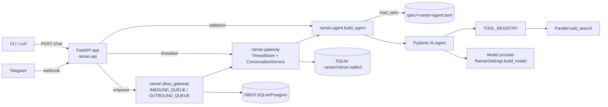

What's in the box, exactly:

| Module | Role |
|---|---|
| `raman/spec.py` | `AgentSpec` Pydantic model loaded from `spec/<name>/agent.toml`. Pulls system prompt, optional context files (own + shared), tool names, and model knobs. |
| `raman/agent.py` | `build_agent(spec, settings)` — returns a `pydantic_ai.Agent[None, str]`. Single chokepoint for agent construction. |
| `raman/context.py` | Builds the runtime context block injected into the system prompt (timezone-aware date, etc.). |
| `raman/cli.py` | `uv run raman` interactive entrypoint. |
| `raman/api.py` | `POST /chat` (stateless), `POST /threads/{interface}/{thread}/messages` (durable, queued), `GET /events/{workflow_id}`, `POST /telegram/webhook`, `GET /healthz`. Caches one `Agent` per spec in `_agents`. |
| `raman/gateway.py` | `ThreadStore` (SQLite, keyed on `(interface, external_thread_id)`), `ConversationService` (loads history → runs agent → persists `result.all_messages_json()`), CloudEvent helpers. |
| `raman/dbos_gateway.py` | `EventDispatcher`, `INBOUND_QUEUE`/`OUTBOUND_QUEUE` (concurrency=1), `process_inbound_message_event` and `deliver_reply_event` workflows. |
| `raman/telegram.py` | `TelegramAdapter` — webhook parse + dedupe, allowlist enforcement, `/start /help /reset /agent` commands, httpx send with 4096-char chunking. |
| `raman/tools.py` | `TOOL_REGISTRY` dict; only `web_search` (Parallel) registered. |
| `raman/settings.py` | `RamanSettings` — env-driven. Includes Telegram, DBOS, and SQLite path config. |
| `pyproject.toml` | Includes `prefect`, `dbos`, `mcp`, `cloudevents`, `dlt`, `duckdb`, `openlit`, OTel. `dbos` and `cloudevents` are now in use; the rest is still scaffolding. |

This shape is good. Each axis below extends it without bulldozing it.

---

## Axis 1: Multi-agent

### Patterns

The literature uses a lot of names for what amount to ~5 distinct patterns. The
clean taxonomy:

| Pattern | Who decides next step | Topology | Good for | Overkill when |
|---|---|---|---|---|
| **Router / dispatcher** | A single classifier (LLM or rules) routes to one specialist | 1-of-N fanout | "Email vs calendar vs research" triage | Two specialists; just call them directly |
| **Orchestrator-worker** | Orchestrator LLM plans, calls workers, collects | Star | A planning step is genuinely needed | The orchestrator is just rephrasing the user's request |
| **Agents-as-tools** | Calling agent treats sub-agent as a tool | Tree | Reusing a specialist from inside a generalist | The "tool" is one prompt; just inline it |
| **Hierarchical (manager/specialist)** | Manager assigns; specialists may call other specialists | Tree, deep | Genuinely nested expertise (planner → researcher → fact-checker) | Always |
| **Swarm / handoff** | Each agent decides who runs next | Mesh | Open-ended exploration | Personal scale (you'll never debug it) |
| **Graph (DAG) workflow** | You define edges; LLMs run nodes | DAG | Repeatable processes with branching | One-shot Q&A |
| **A2A protocol** | Agents in different processes/orgs talk over JSON-RPC | Federated | Cross-team or cross-tenant | One developer, one repo |

### Concrete architectures

#### Router → specialist (start here)

The lowest-cost multi-agent move. Uses raman's existing spec system: each
specialist already maps to a `spec/<name>/agent.toml`. You add a thin router
agent whose only job is to pick a name.

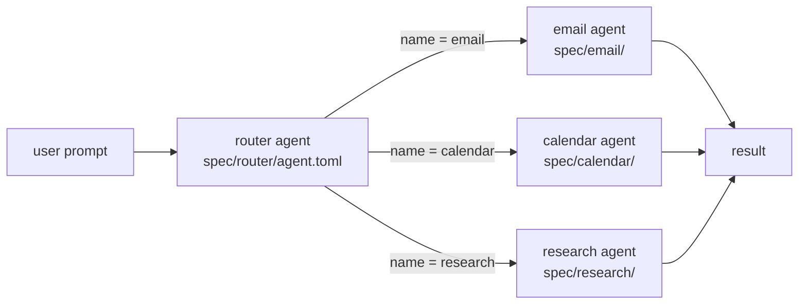

Router can be classifier-style (returns one name; cheap) or executor-style
(calls the chosen specialist itself). Classifier first, executor only if you
want the router to also re-format the result.

Implementation sketch — fits in ~30 lines on top of `raman/api.py`:

```python
# raman/router.py
from pydantic import BaseModel
from pydantic_ai import Agent
from raman.agent import build_agent
from raman.spec import load_spec
from raman.settings import RamanSettings

class Route(BaseModel):
    agent: str
    reason: str

_settings = RamanSettings()
_router = Agent(
    "openai:gpt-5-mini",
    output_type=Route,
    instructions=(
        "Pick the best specialist for this prompt. "
        "Choices: email, calendar, research, raman. "
        "raman is the catch-all."
    ),
)

async def route_and_run(prompt: str) -> tuple[str, str]:
    decision = (await _router.run(prompt)).output
    spec = load_spec(decision.agent, _settings.spec_root)
    agent = build_agent(spec=spec, settings=_settings)
    result = await agent.run(prompt)
    return decision.agent, str(result.output)
```

`POST /chat` becomes a thin wrapper around `route_and_run` when `req.agent` is
None. The existing `_agents` cache in `raman/api.py` already handles the warm
specialist case.

#### Agents-as-tools (one generalist that can summon a specialist)

Use this when you want a single conversational entry point but the model should
sometimes delegate. Pydantic AI delegation passes `ctx.usage` to roll up token
costs — important for cost dashboards.

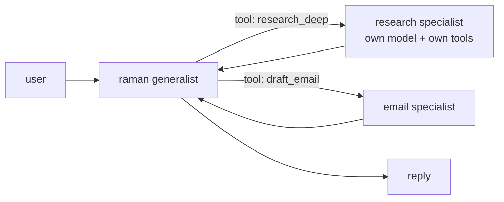

Sketch:

```python
# raman/tools.py — extend TOOL_REGISTRY
from pydantic_ai import RunContext
from raman.agent import build_agent
from raman.spec import load_spec
from raman.settings import RamanSettings

_settings = RamanSettings()
_research = build_agent(spec=load_spec("research", _settings.spec_root), settings=_settings)

async def research_deep(ctx: RunContext[None], topic: str) -> str:
    """Run a multi-step web research pass on a topic. Returns a synthesized answer."""
    result = await _research.run(topic, usage=ctx.usage)  # roll up tokens to caller
    return str(result.output)

TOOL_REGISTRY["research_deep"] = research_deep
```

Then any spec's `agent.toml` can opt in by adding `"research_deep"` to its
`tools` list. Composition stays spec-driven; no code changes per agent.

#### Planner → executor (research crew)

The classic. Planner writes a plan, executor runs each step. Worth it when
planning is non-trivial (multi-source research, multi-step booking).

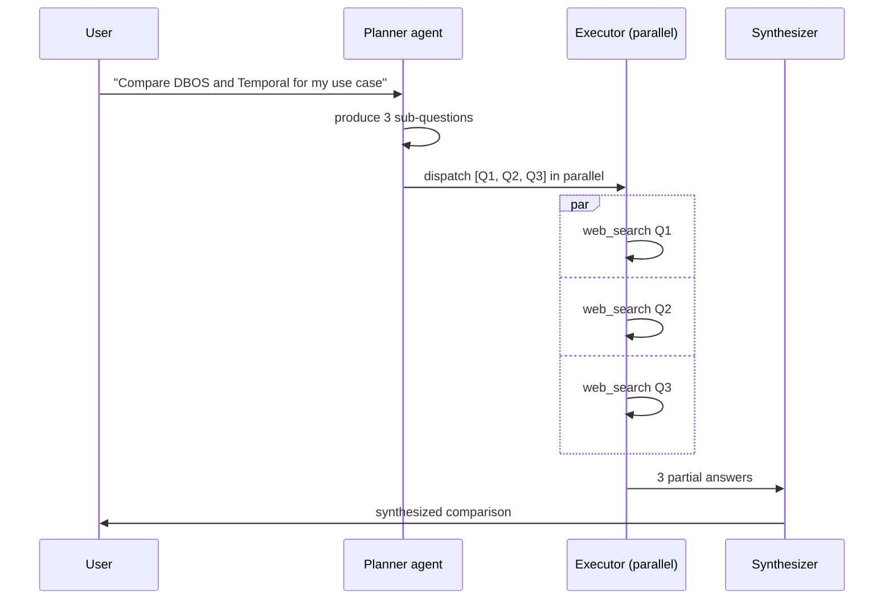

In Pydantic AI, parallel sub-agent calls are an `asyncio.gather` away. Don't
pull in a heavier framework just for fanout.

```python
import asyncio
from pydantic import BaseModel

class Plan(BaseModel):
    sub_questions: list[str]

planner = Agent("openai:gpt-5-mini", output_type=Plan, instructions="...")
worker = build_agent(spec=load_spec("research", ...), settings=...)
synth = Agent("openai:gpt-5", instructions="Synthesize the partial answers...")

async def crew(prompt: str) -> str:
    plan = (await planner.run(prompt)).output
    results = await asyncio.gather(*(worker.run(q) for q in plan.sub_questions))
    bundle = "\n\n---\n\n".join(str(r.output) for r in results)
    return str((await synth.run(f"Question: {prompt}\n\nFindings:\n{bundle}")).output)
```

#### Strands as outer orchestrator (later, only if needed)

When (and only when) you've outgrown hand-rolled `asyncio.gather` plus a router
function, Strands' `Graph` / `Swarm` / `Workflow` give you typed orchestration
primitives. **Strands wraps Pydantic AI agents as nodes** — you keep the spec
system and per-agent factory; Strands just handles the choreography.

The Strands taxonomy (worth memorizing because their docs slice it cleanly):

| Strands primitive | Execution | When raman would use it |
|---|---|---|
| `Graph` | Deterministic edges, LLM picks the route at each node | Approval-gated email send: draft → review → (approve OR revise) → send |
| `Swarm` | Agents hand off to peers via injected `handoff_to_agent` tool | Almost never at personal scale — too non-deterministic to debug |
| `Workflow` | Pure DAG, executed as a single tool | Daily briefing: 3 fetchers in parallel → synthesizer |
| `Agents-as-Tools` | One agent calls another as a tool | Same as the Pydantic AI delegation pattern above |

You don't need Strands to do *any* of these for two agents. You need it when
the orchestration logic itself starts to look like spaghetti — five+ agents,
conditional routing, retries per node.

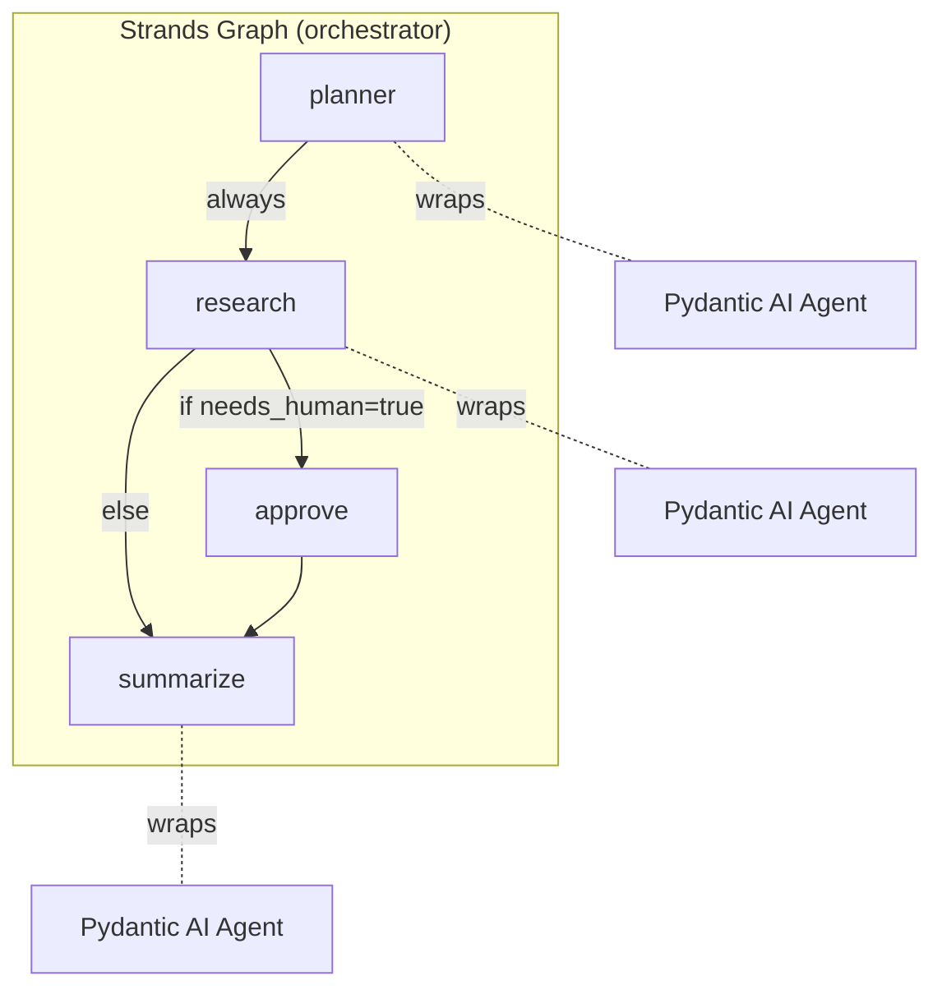

### Library comparison

| Library | License | Multi-agent primitives | Style | When to pick |
|---|---|---|---|---|
| **Pydantic AI** (current) | MIT | Agent delegation, programmatic handoff, deep agents | Functions and types | Default. Manual wiring is fine for ≤4 agents. |
| **Strands Agents** (AWS, OSS) | Apache 2 | Graph, Swarm, Workflow, agents-as-tools | Builder + nodes | When orchestration logic outgrows hand-rolled asyncio. Wraps Pydantic AI cleanly. |
| **LangGraph** | MIT | StateGraph (shared state object across nodes) | Imperative graph | When you genuinely need shared mutable state across nodes (most personal use cases don't) |
| **AutoGen / AG2** | Apache 2 | GroupChat, conversational teams | Agents-have-conversations | When you actually want agents debating each other |
| **CrewAI** | MIT | Role + task DSL, sequential or hierarchical crew | Declarative roleplay | Fast prototype if you like the "agent has a backstory" framing |
| **smolagents** | Apache 2 | Code-as-action (agent writes Python) | Code-first | Local-model heavy, research-y |
| **A2A protocol** | Apache 2 (Linux Foundation) | JSON-RPC envelope for cross-agent talk | Network protocol | When raman needs to talk to *someone else's* agent (e.g. a third-party calendar agent that exposes an A2A card) |

A2A is worth knowing about even if you don't adopt it: it's how raman would
later expose itself to *other* agents on the network without coupling them to
your internal Pydantic AI shape. Think of it as "MCP for agent-to-agent" rather
than "MCP for tool calls."

### Migration path

| Step | Change | Why |
|---|---|---|
| 0 | Today: one agent, optional `req.agent` override | — |
| 1 | Add `spec/research/agent.toml`, `spec/email/agent.toml` etc. | Multi-agent surface area exists; no orchestration yet |
| 2 | Add `raman/router.py` + classifier router | Cheapest possible "smart routing" |
| 3 | Promote some specialists into `TOOL_REGISTRY` as agents-as-tools | Reuse without proliferating endpoints |
| 4 | Add `asyncio.gather`-based fan-out for one specific task (research) | Concrete value before frameworks |
| 5 | If steps 2–4 produce >5 agents and tangled routing → adopt Strands `Graph` as orchestrator, keep Pydantic AI agents underneath | Last, not first |

### Tradeoffs and what to skip

- **Skip swarms.** Emergent handoff is fun in demos and miserable to debug.
  At personal scale, deterministic routing wins every time.
- **Skip A2A until you have a counterparty.** Solo developer, single repo —
  there's no one to be A2A-compatible with yet.
- **Don't conflate "more agents" with "better answers."** Adding a router
  costs you a whole extra LLM round-trip per request. Worth it if specialists
  have meaningfully different tools or context, dead weight if not.
- **Hierarchical (manager-of-managers) is almost always overkill.** You'll know
  if you need it. You don't.

---

## Axis 2: Workflows

### The conceptual split that matters

Most "agentic workflow" articles smush two distinct things together:

| Kind | Who decides the steps | Failure mode | Example |
|---|---|---|---|
| **Agentic workflow** | The model, at runtime, by emitting tool calls in a loop | Model picks a dumb sequence; you discover this in logs | `agent.run("book me a flight")` decides to call `search_flights` then `pick_seat` |
| **Deterministic workflow** | Code, defined ahead of time | Code is wrong (deterministically) | `flow: fetch_calendar() >> fetch_email() >> summarize() >> send_email()` |

Pydantic AI handles the first natively. The second is what `prefect` / `dbos`
/ Temporal exist for. **Most "agent automation" is actually case 2 with one
case-1 step inside it** — a daily briefing is a deterministic 4-step pipeline
where step 3 happens to call an LLM.

### Patterns

| Pattern | Description | Tool | Example for raman |
|---|---|---|---|
| **Scheduled** | Cron-style trigger | Prefect, DBOS, plain cron | 7am daily briefing |
| **Event-driven** | External event → workflow | FastAPI webhook → handler, optionally CloudEvents wrapper | Incoming email triggers reply draft |
| **Long-running with checkpointing** | Survives restarts | DBOS, Temporal | Multi-hour research task |
| **Human-in-loop** | Pauses for approval | DBOS workflow with `recv()`, Prefect with `pause_flow_run`, Temporal signals | Approve before sending email |
| **Fan-out / fan-in** | Parallel work, then join | `asyncio.gather`, Prefect mapped tasks, Strands Workflow | Research crew (above) |
| **Retry / circuit breaker** | Tolerate flaky upstreams | DBOS step retries, Prefect task retries, manual `tenacity` | Parallel API hiccup, OpenAI 5xx |
| **Idempotency** | Side-effects exactly once | DBOS `@step` is idempotent on retry by default | "Don't double-send the email" |

### Concrete examples

#### Daily 7am briefing (scheduled, deterministic)

```mermaid
gantt
    title Daily briefing — 7:00 AM local
    dateFormat HH:mm:ss
    axisFormat %H:%M:%S

    section Fetch (parallel)
    Calendar (Google MCP)        :a1, 07:00:00, 4s
    Unread email (Gmail MCP)     :a2, 07:00:00, 8s
    News (Parallel web_search)   :a3, 07:00:00, 6s

    section Synthesize
    LLM summarize via raman      :s1, after a1 a2 a3, 12s

    section Deliver
    Push notification to phone   :d1, after s1, 1s
    Email backup to inbox        :d2, after s1, 2s
```

Two viable engines:

```python
# Option A — Prefect (rich UI, good for many flows)
from prefect import flow, task
from raman.agent import build_agent

@task(retries=3, retry_delay_seconds=10)
async def fetch_calendar(): ...

@task(retries=3, retry_delay_seconds=10)
async def fetch_email(): ...

@task(retries=3, retry_delay_seconds=10)
async def fetch_news(): ...

@flow(name="morning-brief")
async def morning_brief():
    cal, mail, news = await asyncio.gather(fetch_calendar(), fetch_email(), fetch_news())
    summary = await build_agent().run(f"Brief me. Cal:\n{cal}\nMail:\n{mail}\nNews:\n{news}")
    await deliver(str(summary.output))

if __name__ == "__main__":
    morning_brief.serve(name="daily-7am", cron="0 7 * * *")
```

```python
# Option B — DBOS (durable, survives restart, no extra UI)
from dbos import DBOS
from datetime import datetime

@DBOS.workflow()
def morning_brief(scheduled_time: datetime, ctx) -> None:
    cal = fetch_calendar()
    mail = fetch_email()
    news = fetch_news()
    summary = summarize(cal, mail, news)        # @DBOS.step
    deliver(summary)                             # @DBOS.step (exactly-once)

DBOS.create_schedule(morning_brief, cron="0 7 * * *", schedule_name="daily-brief")
```

DBOS' `create_schedule` writes the cron to its Postgres metadata; the schedule
key is `(schedule_name, scheduled_time)` so a restart at 7:00:01 doesn't
re-fire the 7:00:00 run. Plain cron can't promise that.

#### Long-running research with checkpoints

User says "go research X for the next hour." Process restarts halfway through.
Without durability, you've lost the work. With DBOS, the workflow resumes from
the last completed step.

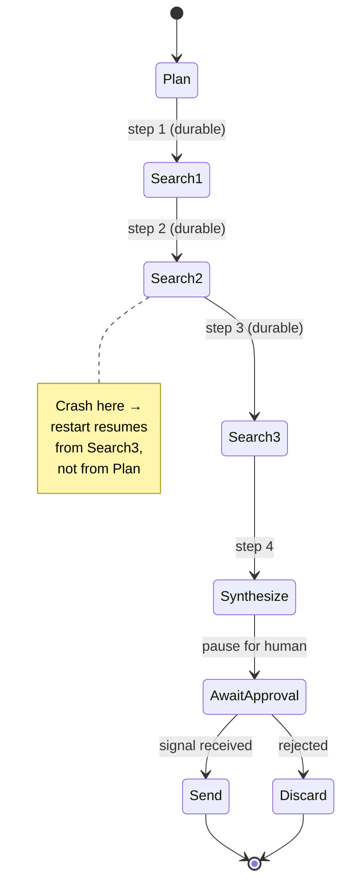

```python
@DBOS.workflow()
def research(topic: str) -> None:
    plan = make_plan(topic)            # @DBOS.step
    findings = []
    for q in plan:
        findings.append(search(q))     # @DBOS.step — each search checkpointed

    draft = synthesize(findings)        # @DBOS.step

    approval = DBOS.recv(timeout_seconds=86400)   # block until /approve hits the API
    if approval == "approve":
        send_email(draft)              # @DBOS.step (idempotent — won't double-send)
```

The approval message is delivered via:

```python
@app.post("/approve/{workflow_id}")
async def approve(workflow_id: str, decision: str):
    DBOS.send(workflow_id, decision)
    return {"ok": True}
```

This is the killer feature DBOS brings that Prefect doesn't (cleanly): durable
inbox-style messaging into a paused workflow.

#### Tool-call retry with circuit breaker

External APIs (Parallel, Anthropic, your STT provider) all fail 0.5–2% of the
time. Wrap the side-effecting tool, not the agent.

```python
# raman/tools.py — wrap web_search
from tenacity import retry, stop_after_attempt, wait_exponential
from circuitbreaker import circuit

@circuit(failure_threshold=5, recovery_timeout=60)
@retry(stop=stop_after_attempt(3), wait=wait_exponential(multiplier=1, max=10))
async def web_search(query: str) -> str:
    # current body unchanged
    ...
```

If you adopt DBOS for the surrounding workflow, replace `tenacity` with
`@DBOS.step(retries_allowed=True, max_attempts=3)` so the retry is durable and
visible in the DBOS UI. Don't stack both — counts multiply.

#### Human-in-loop email send

Already shown above (the `DBOS.recv` pattern). The architecture diagram:

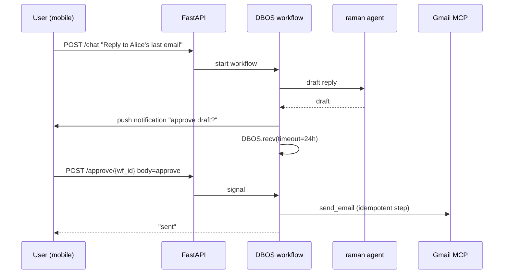

### Library comparison

| Engine | Best at | Personal-scale fit | Ops cost on DO | Skip if |
|---|---|---|---|---|
| **Plain cron + FastAPI background tasks** | Trivial scheduling | Excellent for v0 | $0 | You need durability |
| **Prefect 3** | Many flows, rich UI, dependency graphs, observability | Good — but the UI is the value-add. Worth it if you have ≥3 distinct flows | Free OSS server on a $5 droplet, or Prefect Cloud free tier | You only have one daily job |
| **DBOS** | Durable execution, exactly-once side effects, human-in-loop | **Excellent.** Embedded in your FastAPI process, SQLite for local / Postgres for prod, no separate worker. | $0 (SQLite) or +$15/mo for managed Postgres. No extra service. | You don't care about crash safety |
| **Temporal** | Long-running, multi-language, deterministic replay | Overkill. Self-hosted Temporal cluster is a real ops job. | $50+/mo at minimum | Always at personal scale |
| **LangGraph** as workflow runtime | Stateful agentic loops with branching | Use for *agentic* loops, not for cron jobs | Bundled with your app | Your workflow is not LLM-heavy |
| **Inngest** | Event-driven serverless workflows | Slick if you live in Vercel-land | Free tier; $20+/mo at scale | You want to stay self-hosted |

DBOS + Prefect compose cleanly: Prefect is the scheduler/UI, DBOS is the
durability layer for individual steps. From `library_examples.md` (already
internalized): "Prefect schedules a flow, inside which a DBOS workflow does the
durable bit." Don't pick one to the exclusion of the other if you want both
properties.

### Migration path

| Step | Change | Engine | Why |
|---|---|---|---|
| 0 | Today: nothing scheduled | — | — |
| 1 | One Python script behind `cron` (or systemd timer) calling FastAPI | OS cron | Cheapest possible thing |
| 2 | Move that script into a `@DBOS.scheduled` workflow inside the FastAPI process | DBOS | Get exactly-once + crash safety for free; no new service |
| 3 | Add a second workflow with human-in-loop (approve email) | DBOS | Validates the `recv` pattern |
| 4 | If you grow to 5+ flows or want a UI: add Prefect on top | Prefect | UI starts paying for itself |
| 5 | Skip Temporal forever (at personal scale) | — | — |

> **Status.** DBOS is now scaffolded in-process for the gateway (queues +
> workflows, SQLite system DB at `.raman/dbos.sqlite3`). The first scheduled
> workflow hasn't been added yet — when it lands it slots straight into the
> existing `launch_dbos`/`shutdown_dbos` lifecycle in `raman/api.py`.

### Tradeoffs and what to skip

- **Don't introduce Prefect for one cron job.** A `@DBOS.scheduled` decorator
  inside your existing FastAPI process is one line and zero new infra.
- **Don't run two retry layers in series.** Pick the outermost-that-can-prove-
  safe-to-retry. Per `library_examples.md`: "the outermost layer that can
  prove the call is safe to retry owns the policy."
- **Skip self-hosted Temporal.** It's a clustered Cassandra/Postgres + worker
  pool deployment that requires real operational attention. Magnificent at
  scale, miserable for one user.
- **DBOS uses Postgres in prod.** SQLite is fine for local dev and a
  single-process deploy. The moment you have ≥2 worker processes, you need
  Postgres so they share state. On DO that's the $15/mo managed PG.

---

## Axis 3: Multimodal

### Modality matrix

| Direction | Modality | Today's options (May 2026) |
|---|---|---|
| **In** | Voice | Whisper local, Groq Whisper Turbo (~$0.0006/min), Deepgram Nova-3 streaming (sub-300ms first token), OpenAI Realtime, ElevenLabs Scribe |
| **In** | Image | Claude Sonnet 4.6 vision (~6.6k tokens/phone photo), GPT-5.5 (~2.5k tokens/photo), Gemini 3 Pro (258 tokens per 768px tile) |
| **In** | PDF / docs | Most frontier models accept PDF natively; Pydantic AI passes through `BinaryContent` |
| **In** | Screen capture | Same as image — just a PNG |
| **Out** | Voice | OpenAI TTS, ElevenLabs ($0.06–$0.30 / 1k chars depending on tier), Cartesia (~⅕ of ElevenLabs price), Kokoro (local OSS) |
| **Out** | Image gen | DALL-E 3, Imagen 4, Flux, SDXL local |
| **Out** | Structured docs | Already free via Pydantic AI typed `output_type` |
| **Out** | Charts | Tool that calls matplotlib/plotly, returns PNG via `BinaryContent` |

### Realtime vs request/response

Two fundamentally different shapes:

| Shape | Example | Architecture | When |
|---|---|---|---|
| **Turn-based** | "Send a voice note, get a voice note back" | Mobile records → upload → STT → agent → TTS → audio response | Asynchronous use, voicemail style. **Default for personal scale.** |
| **Realtime bidi** | "Hold a phone call with raman" | WebSocket open the whole time, VAD detects user pauses, agent can interrupt | Hands-free use (driving, walking). Big jump in complexity and cost. |

### Concrete architectures

#### Voice-note pipeline (turn-based)

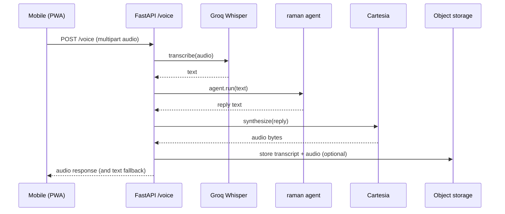

Sketch — sits cleanly next to existing `POST /chat`:

```python
# raman/api.py — additions
from fastapi import UploadFile, File
from fastapi.responses import Response

@app.post("/voice")
async def voice(audio: UploadFile = File(...)) -> Response:
    text = await stt_transcribe(await audio.read(), audio.content_type)
    result = await _get_agent(_get_settings().default_agent).run(text)
    audio_bytes = await tts_synthesize(str(result.output))
    return Response(content=audio_bytes, media_type="audio/mpeg",
                    headers={"X-Transcript": text, "X-Reply-Text": str(result.output)})
```

`stt_transcribe` and `tts_synthesize` are ~10-line wrappers around Groq and
Cartesia respectively. Both expose OpenAI-compatible APIs — use `openai`
client with the right `base_url` if you want zero adapter code.

#### Image-attached chat

Pydantic AI handles this natively. The same `agent.run()` accepts a list mixing
text and `BinaryContent`. No new endpoint architecture needed — just accept a
multipart upload and pass it through.

```python
# raman/api.py — additions
from pydantic_ai import BinaryContent

@app.post("/multimodal-chat")
async def mm_chat(prompt: str, image: UploadFile | None = None):
    parts: list = [prompt]
    if image is not None:
        parts.append(BinaryContent(data=await image.read(), media_type=image.content_type))
    result = await _get_agent(_get_settings().default_agent).run(parts)
    return {"output": str(result.output)}
```

Picking the model matters here. Cost per typical phone photo (May 2026):

| Model | Tokens/photo | At input rate | $/photo |
|---|---|---|---|
| Claude Sonnet 4.6 | ~6,600 | $3 / 1M | $0.020 |
| GPT-5.5 | ~2,450 | $5 / 1M | $0.012 |
| Gemini 3 Pro | depends on tile count | varies | typically lowest |

Gemini wins on cost for image-heavy use; Claude tends to be the most accurate
on detailed photos and screenshots; GPT-5.5 is the middle. Pick per-spec —
your `agent.toml` already supports model overrides.

#### Realtime bidirectional voice (advanced)

Only build this if you want to literally talk to raman like a phone call. Two
implementation paths:

| Path | Description | Tradeoff |
|---|---|---|
| **OpenAI Realtime API** | One WebSocket to OpenAI, audio in / audio out, model handles VAD and interruption | $32/$64 per 1M audio in/out tokens (~$0.30 per minute of conversation). Locks you to OpenAI. |
| **Custom pipeline** | Mobile WS → FastAPI WS → (Deepgram streaming STT) → (LLM streaming) → (Cartesia streaming TTS) → back to mobile | More moving parts. Provider-neutral. ~⅓ the cost. |

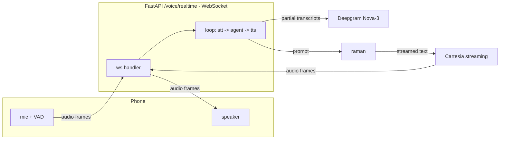

For personal use, **start with the OpenAI Realtime API.** It's a wire-in-once
toy you'll either love or quickly abandon. The custom pipeline is a 2-week
project — only justified if you both love it and want to swap out providers.

### Migration path on top of existing FastAPI

| Step | Change | Effort |
|---|---|---|
| 0 | Today: text-only `POST /chat` | — |
| 1 | Add `BinaryContent` support to `/chat` (accept optional image upload) | 30 minutes |
| 2 | Add `POST /voice` (audio-in, audio-out, turn-based) | ~2 hours including TTS/STT API keys |
| 3 | Add streaming text via SSE to `/chat/stream` (Pydantic AI `agent.run_stream()` → `EventSourceResponse`) | ~1 hour |
| 4 | (Optional) Add `WS /voice/realtime` using OpenAI Realtime as the backend | ~1 day |
| 5 | (Optional, only-if-you-must) Custom realtime pipeline with Deepgram + Cartesia | ~2 weeks |

The Pydantic AI `BinaryContent` support means image input is *not* a new
architectural surface — it's just another argument shape inside the existing
`agent.run()` call. That's the move.

### Tradeoffs and what to skip

- **Skip training your own STT/TTS.** Whisper Turbo on Groq is $0.04/hr.
  The economics of self-training will never make sense for one user.
- **Skip image generation as a default.** Wire it as a tool, not a core flow.
  Most personal-assistant requests don't want a generated image.
- **Don't chase the lowest-latency STT for turn-based use.** Deepgram is
  spectacular at sub-300ms first-token latency, but for a "send a voice note,
  get a reply" flow nobody cares if it took 700ms or 200ms. Use Groq.
- **Realtime is a different product.** It's a phone call with raman, not the
  raman chat with audio bolted on. Treat it as a separate axis decision.
- **Cache the TTS output** if you have repeat phrases (greetings, error
  messages). Cheapest perf win.

---

## Axis 4: Mobile interface

> **Status (2026-05-09).** A *messenger-as-interface* path landed before any
> of the PWA/native options below: Telegram is wired in via webhook with
> chat allowlisting and durable per-thread history. It piggybacks on the
> Telegram mobile/desktop apps you already have, so most of the "phone in
> my pocket" benefit is already there at zero client-side build cost. The
> PWA / Expo work below is still the right move when you want first-class
> push, voice capture, or a custom UI — Telegram covers the text-chat case
> in the meantime.

### Approach matrix

| Approach | Build cost | Native feel | Push notifications | App store overhead | Right for raman |
|---|---|---|---|---|---|
| **Messenger-as-interface (Telegram)** | Lowest (server-side only) | Native — uses Telegram's app | Yes (Telegram handles it) | None | **[done]** Shipped 2026-05; default for text chat |
| **PWA** (web app, "Add to Home Screen") | Lowest | Good (iOS 16.4+ supports web push for installed PWAs) | Yes (web push, requires PWA installed) | None | Right when you outgrow text-only chat (voice capture, custom UI) |
| **Capacitor** (web wrapped in native shell) | Low | Decent | Yes (APNs/FCM via plugins) | Yes | If PWA hits a hard wall |
| **React Native / Expo** | Medium | Very good | Yes (Expo Push, wraps APNs/FCM) | Yes (TestFlight + Play internal track) | If you want a real native feel and one codebase |
| **Flutter** | Medium-high | Very good | Yes | Yes | If you already know Dart; otherwise no reason |
| **Tauri Mobile** (Rust) | High (early) | Good | Limited tooling | Yes | OSS purist play; not yet ergonomic |
| **Native (Swift / Kotlin)** | Highest | Best | Yes (direct APNs/FCM) | Yes | Only if you genuinely want platform-specific features (Live Activities, Widgets) |

### Personal-use specifics

**Auth.** It's your app for you. You don't need OAuth. Two reasonable shapes:

| Scheme | Mechanism | When |
|---|---|---|
| Bearer token in env | Mobile app stores a long-lived secret in keychain, sends `Authorization: Bearer ...` | v0. Just works. |
| JWT with long-lived refresh | Phone has refresh token (30 days), exchanges for short-lived JWT | If you ever expect to share with one other person |

Skip OAuth. Skip Auth0 / Clerk / Supabase Auth. The asymmetry is one user, one
device — there is no identity problem to solve.

**Push notifications.** Two routes:

| Route | Setup | Cost | Limitations |
|---|---|---|---|
| **Web Push (PWA)** | VAPID key pair, service worker, browser subscribe API | $0 | Only works once user installs PWA to home screen on iOS |
| **APNs + FCM (native or Expo)** | APNs cert from Apple Dev ($99/yr), FCM project free | $99/yr Apple Dev | Real native push; no PWA install requirement |

For raman: start with web push. If you find yourself missing notifications
because the PWA service worker got reaped (iOS aggressively cleans up SWs for
inactive PWAs), upgrade to Expo + Expo Push. Apple Dev account becomes
unavoidable at that point.

**Backend.** Your existing FastAPI is the mobile backend. Minimal additions:

```python
# raman/api.py — additions for mobile
from fastapi import WebSocket
from fastapi.responses import StreamingResponse
import json

@app.post("/chat/stream")
async def chat_stream(req: ChatRequest):
    """SSE streaming for mobile incremental rendering."""
    agent = _get_agent(req.agent or _get_settings().default_agent)
    async def gen():
        async with agent.run_stream(req.prompt) as result:
            async for chunk in result.stream_text(delta=True):
                yield f"data: {json.dumps({'token': chunk})}\n\n"
            yield "data: {\"done\": true}\n\n"
    return StreamingResponse(gen(), media_type="text/event-stream")

@app.websocket("/ws")
async def websocket_chat(ws: WebSocket):
    await ws.accept()
    while True:
        msg = await ws.receive_json()
        agent = _get_agent(msg.get("agent") or _get_settings().default_agent)
        async with agent.run_stream(msg["prompt"]) as result:
            async for chunk in result.stream_text(delta=True):
                await ws.send_json({"type": "token", "value": chunk})
        await ws.send_json({"type": "done"})

@app.post("/push/register")
async def register_push(token: str):
    # store in DuckDB / DBOS state for later use by workflows
    ...
```

**Offline.** Don't bother. Every interesting raman action requires an LLM call,
which requires the network. Implement this single behavior: when offline, queue
the user's input locally and replay on reconnect. Anything more is yak-shaving.

### Concrete architectures

#### PWA + FastAPI on DO App Platform (recommended starting point)

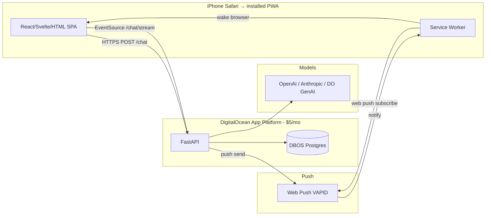

Cost: $5/mo for the App Platform service + $15/mo if you adopt managed Postgres
for DBOS. $20/mo total. No app store. No certificate. Push works as long as
the user installs the PWA to their home screen.

#### Expo + FastAPI + Expo Push (native upgrade)

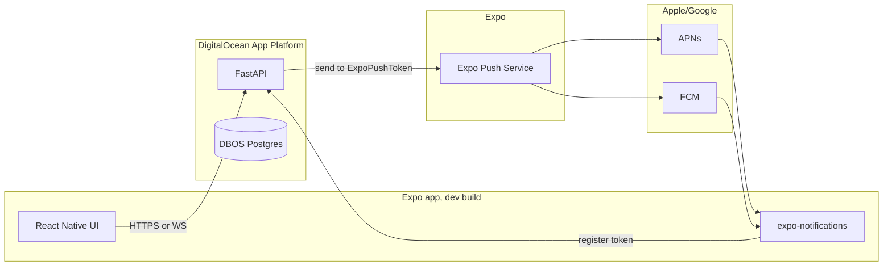

Note (April 2025+): Expo dropped Android push support from Expo Go. You now
need a development build to test push, even on personal projects. Plan for
~1 day of EAS Build setup.

#### Voice-first mobile interface

Same backend `/voice` endpoint as in Axis 3. Mobile-specific UX:

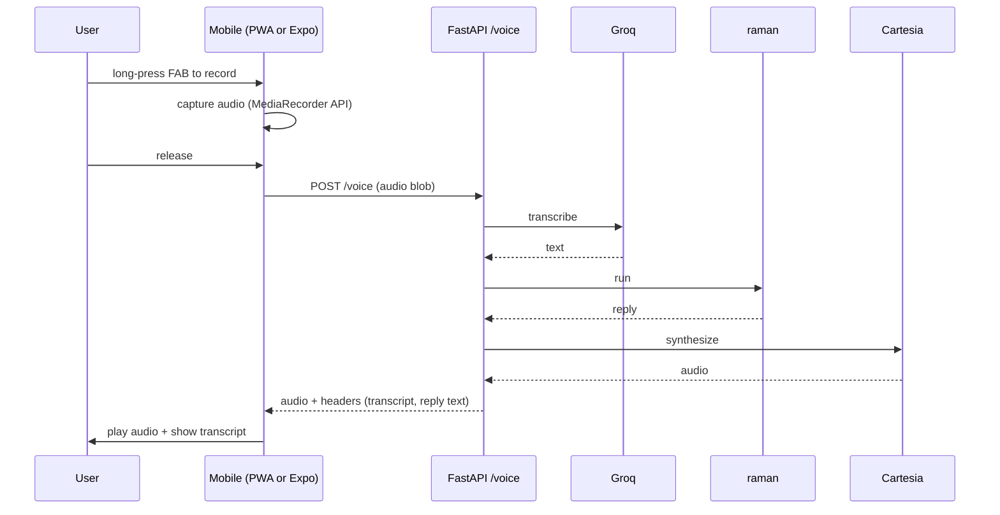

The `MediaRecorder` API works in iOS 14.3+ Safari (so all modern iPhones). No
native code required — this works in a PWA.

### Streaming on mobile: SSE vs WebSocket

| Property | SSE (`text/event-stream`) | WebSocket |
|---|---|---|
| Direction | Server → client only | Bidirectional |
| Browser API | `EventSource` | `WebSocket` |
| Reconnect | Automatic with `Last-Event-ID` | Manual |
| Mobile background | Drops on backgrounding | Drops on backgrounding |
| Effort | Trivial | Light, but you write the protocol |
| Right for | Token streaming, log tail | Voice realtime, presence |

SSE is right for everything except realtime voice. The mobile client is just:

```js
// minimal PWA streaming chat
const es = new EventSource("/chat/stream", { method: "POST", body: JSON.stringify({prompt}) });
es.onmessage = (e) => {
  const data = JSON.parse(e.data);
  if (data.done) es.close();
  else appendToken(data.token);
};
```

(`EventSource` doesn't natively support POST — use the `fetch-event-source`
polyfill. One npm install, ~3kb.)

### Distribution path

| Stage | Distribution | Effort | When |
|---|---|---|---|
| 0 | Open URL on phone Safari | None | First demo |
| 1 | Add to Home Screen (PWA install) | Add manifest.json + SW | Daily use |
| 2 | TestFlight or Play Internal Test | Apple Dev $99/yr or Play $25 one-time | Want push notifications without PWA install constraint |
| 3 | App Store / Play Store public | Real review process | Never, for personal |

### Tradeoffs and what to skip

- **Skip dual native codebases.** One developer cannot maintain both Swift and
  Kotlin for a personal app.
- **Skip the App Store.** TestFlight (iOS) or Play internal track is enough
  for one user. App Store review is a multi-week saga for zero benefit.
- **PWA push limitations on iOS are real.** If your service worker fails to
  display a notification when a push arrives, iOS will revoke your push
  subscription. iOS 18.4 added Declarative Web Push which is a workaround
  (push payload itself drives the notification, no JS needed). If you find
  push reliability spotty on iOS, that's the upgrade.
- **Don't build an offline-first sync engine.** You're online or you're not.
  The agent does nothing useful offline.
- **Don't build a full chat UI from scratch.** Use Vercel AI Elements (Pydantic
  AI ships an adapter), assistant-ui, or just steal a free template. The chat
  bubble is not where you'll add value.

---

## Recommended sequencing

You shouldn't do all four at once. Ranked by leverage-per-hour for personal use:

| Rank | Move | Why first / why later | Approximate effort |
|---|---|---|---|
| **1** | ~~**Mobile PWA + SSE streaming**~~ → **Telegram interface** | The phone-in-pocket need was met by wiring Telegram instead of building a PWA. PWA is now optional, only when you want voice capture or custom UI. | **[done]** |
| **2** | **Voice in/out (turn-based)** | Faster to dictate than to type on a phone. With Telegram already shipping, the cheapest path is a Telegram voice-note handler (STT in, text reply out, optional TTS reply); a PWA `/voice` endpoint becomes the alternative once you want full duplex. | 1 day (Telegram voice) |
| **3** | **One scheduled DBOS workflow** (morning briefing) | DBOS is already running in-process for the gateway, so adding a `@DBOS.scheduled` flow is a one-decorator move. Concrete habit-forming value. | Half a day |
| **4** | **Router-based multi-agent** | Don't multi-agent until you have ≥2 specialists with meaningfully different tools/context. The 7am-briefing flow above will surface the need. The Telegram `/agent <name>` command already lets the user pick a specialist explicitly per thread. | Half a day, plus per-specialist spec |
| **5** | **Image input on `/chat`** | Easy add via `BinaryContent`; low daily-use rate but high "wow" payoff when needed. | 30 minutes |
| **6** | **Human-in-loop approval** (DBOS `recv`) | Genuinely useful only after you've built a workflow that does something irreversible (send email, charge card). | Half a day |
| **7** | **Strands as orchestrator** | Only when you have ≥5 agents and the routing/conditional logic in Python is becoming spaghetti. | 2–4 days |
| **8** | **Realtime voice** | Coolest demo, lowest day-to-day utility. Save for "I have a free Saturday." | 1–14 days depending on pipeline choice |
| **9** | **Push notifications** | After you have at least one workflow producing async results worth being interrupted for. | Half a day (web push) to 2 days (Expo) |
| **10** | **Native Expo app** | Only if PWA limitations bite. | 3–5 days |

### If you only do one thing next, do this

**Ship the PWA with `/chat/stream` over SSE, behind your existing FastAPI on
DO App Platform, with a long-press voice button calling a new `/voice`
endpoint.** That's a weekend's work and it converts raman from a thing you
remember exists when you're at your laptop into a thing you reach for in line
at the coffee shop. Every other axis becomes more obviously valuable once
raman lives in your pocket.

---

## Endgame architecture

What it looks like once all four axes have matured:

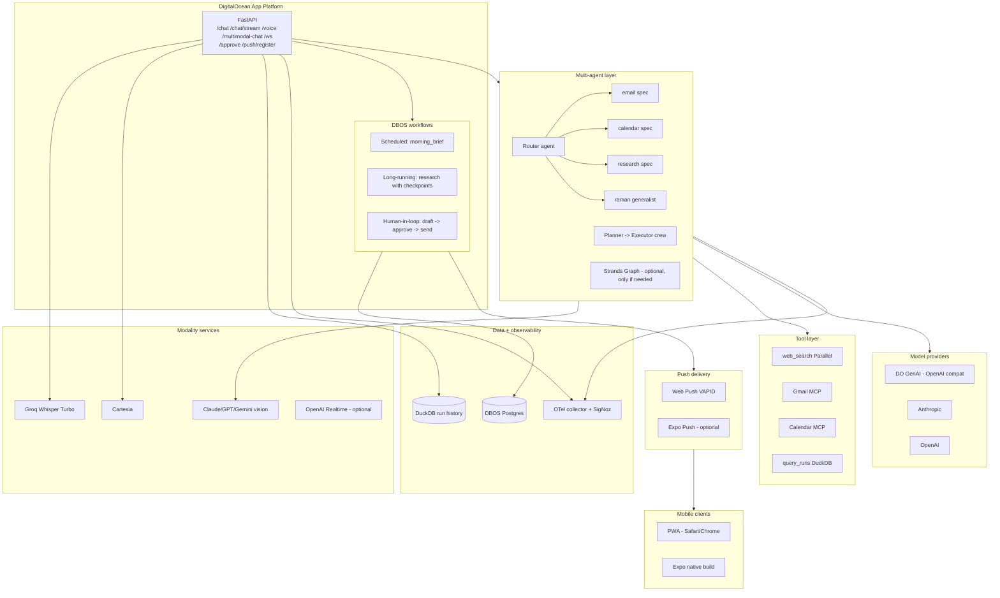

Composition observations:

- The **spec system is the universal joint.** Every agent (specialist,
  generalist, router) is a spec. Every modality endpoint terminates in
  `build_agent(...)`. Every workflow step that calls an LLM calls
  `build_agent(...)`. Don't ever bypass it.
- **DBOS is the only stateful new component.** Postgres is the only new
  managed dependency. Everything else is libraries-in-process.
- **The mobile client never knows about agents.** It sees a stable HTTP
  surface — `/chat`, `/voice`, `/multimodal-chat`, `/ws`. The orchestration
  pattern (single agent vs router vs crew vs Strands graph) can change
  underneath without the mobile app caring.
- **Observability stays unified.** OpenLit auto-traces model calls, OTel
  carries everything else, structlog injects trace IDs. Don't fork.

---

## What to skip for personal scale

A blunt list. Easier to remember as "don't" than "consider":

| Don't | Why not, briefly |
|---|---|
| Self-host Temporal | Multi-service cluster ops job. DBOS gives you 80% of the value for 5% of the work. |
| Kubernetes anything | DO App Platform exists. K8s for one user is a hobby, not infra. |
| Train your own STT/TTS | $0.04/hour Groq Whisper. The math will never math. |
| Native iOS + Android dual codebase | One person, one codebase. Expo or PWA. |
| OAuth provider (Auth0 / Clerk / etc.) | One user. A bearer token in keychain is the right answer. |
| App Store distribution | TestFlight / Play Internal is enough; review process is a tax. |
| Multi-tenant anything | You are one tenant. The day you have a second one, refactor. |
| Vector DB | Until you have a real RAG corpus, DuckDB full-text + LLM context is enough. |
| Self-hosted models on a GPU droplet | DO GenAI inference is OpenAI-compatible and cheaper than running a GPU you don't keep saturated. |
| LangChain (the umbrella, not LangGraph) | Pydantic AI does the agent loop better; everything else in LangChain has a sharper alternative. |
| A2A protocol implementation | No counterparty. Wait until someone publishes an A2A agent card you actually want to call. |
| Swarm / autonomous handoff multi-agent | Non-deterministic. You will spend more time debugging than building. |
| Custom realtime voice pipeline before trying OpenAI Realtime | One WebSocket vs three streaming providers — start with the easy one. |
| Enterprise observability (Datadog, New Relic) | Local SigNoz container is free and gives you 100% of what one user needs. |
| Eval harnesses beyond `pydantic-evals` | You already have it. Add cases as you encounter regressions, not preemptively. |
| Workflow UI that isn't Prefect's free OSS dashboard | DBOS has its own. Don't build one. |

---

## Sources

Multi-agent
- Pydantic AI Multi-Agent Applications: https://pydantic.dev/docs/ai/guides/multi-agent-applications/
- Strands Agents Multi-Agent Patterns: https://strandsagents.com/docs/user-guide/concepts/multi-agent/multi-agent-patterns/
- Strands Graph Pattern: https://strandsagents.com/docs/user-guide/concepts/multi-agent/graph/
- Strands Swarm Pattern: https://strandsagents.com/docs/user-guide/concepts/multi-agent/swarm/
- A2A Protocol: https://a2a-protocol.org/latest/
- A2A Linux Foundation announcement: https://www.linuxfoundation.org/press/a2a-protocol-surpasses-150-organizations-lands-in-major-cloud-platforms-and-sees-enterprise-production-use-in-first-year
- LangGraph vs Pydantic AI 2026: https://www.zenml.io/blog/pydantic-ai-vs-langgraph
- AutoGen / CrewAI / smolagents survey: https://medium.com/@atnoforgenai/10-ai-agent-frameworks-you-should-know-in-2026-langgraph-crewai-autogen-more-2e0be4055556

Workflows
- DBOS Scheduled Workflows: https://docs.dbos.dev/python/tutorials/scheduled-workflows
- DBOS GitHub: https://github.com/dbos-inc/dbos-transact-py
- DBOS in Pydantic AI: https://ai.pydantic.dev/durable_execution/dbos/
- Prefect vs Temporal vs DBOS: https://dev.to/mahdi0shamlou/mahdi-shamlou-durable-workflow-engines-comparison-temporal-dbos-transact-prefect-custom-3a6a

Multimodal
- Pydantic AI image / audio / video / document input: https://ai.pydantic.dev/input/
- Groq Whisper Large v3 Turbo: https://groq.com/blog/whisper-large-v3-turbo-now-available-on-groq-combining-speed-quality-for-speech-recognition
- Whisper / Deepgram / Groq comparison 2026: https://littlewhisper.app/blog/openai-whisper-vs.-deepgram-vs.-groq-which-transcription-api-is-right-for-you/
- ElevenLabs vs Cartesia 2026: https://elevenlabs.io/blog/elevenlabs-vs-cartesia
- OpenAI Realtime / GPT Realtime pricing: https://openai.com/index/introducing-gpt-realtime/
- Vision pricing per image (Claude / GPT / Gemini): https://blog.roboflow.com/image-token-cost-vlm/

Mobile
- iOS Web Push & PWA limits 2026: https://www.magicbell.com/blog/pwa-ios-limitations-safari-support-complete-guide
- Declarative Web Push (Safari 18.4): https://webscraft.org/blog/pwa-pushspovischennya-na-ios-u-2026-scho-realno-pratsyuye?lang=en
- Expo Push Notifications 2026 guide: https://reactnativerelay.com/article/react-native-push-notifications-expo-complete-guide-2026
- Expo dropped Android push from Expo Go: https://docs.expo.dev/guides/using-push-notifications-services/
- DigitalOcean App Platform pricing & WebSocket support: https://www.digitalocean.com/pricing/app-platform
- DO Inference (OpenAI compat): https://docs.digitalocean.com/products/inference/
- FastAPI EventSourceResponse + SSE: https://fastapi.tiangolo.com/tutorial/server-sent-events/
- Pydantic AI streaming UI adapters: https://ai.pydantic.dev/ui/overview/
