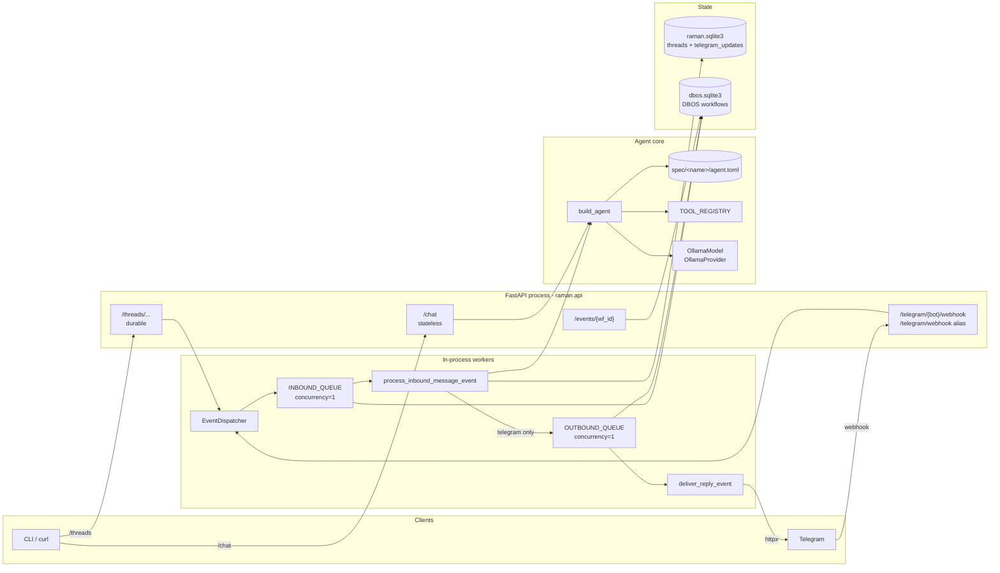
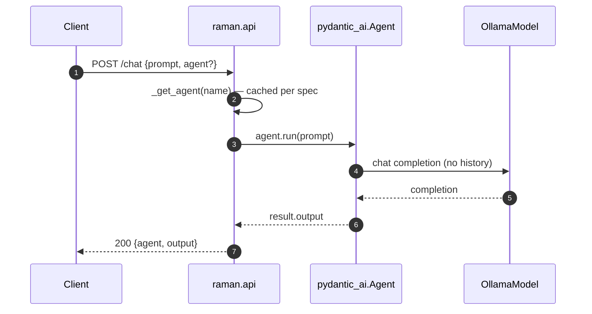
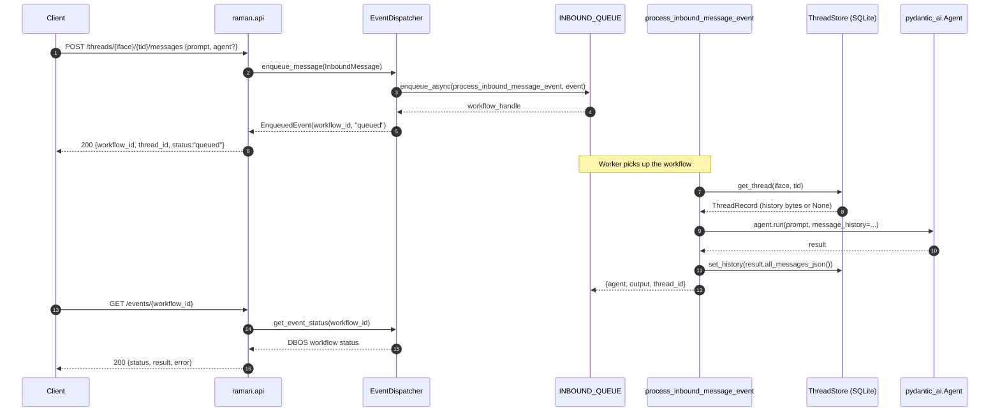
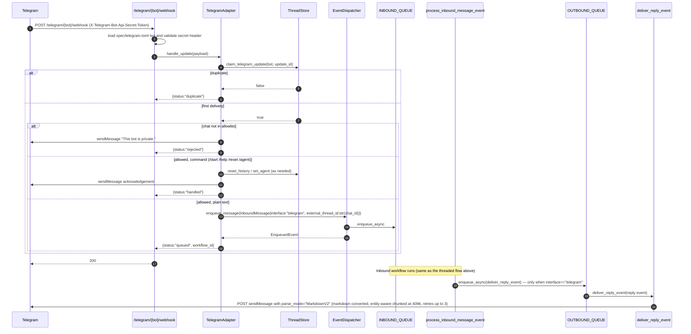
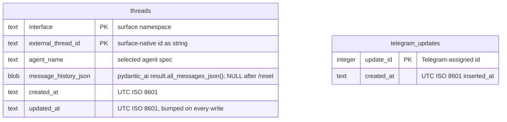

# Current Architecture

Snapshot of what's actually in `main` as of **2026-05-10**. This doc describes
*what exists*; for *where things are headed*, see
[architecture_roadmap.md](architecture_roadmap.md).

All diagrams render natively on GitHub (mermaid). The relational schema also
lives as machine-checked DBML at [`schema.dbml`](schema.dbml) — `pydbml` (dev
dep) parses it; the generated SQL matches `raman/gateway.py::ThreadStore.
_init_schema` 1:1.

## Contents

- [Topology](#topology)
- [Module map](#module-map)
- [Request flows](#request-flows)
  - [Stateless `POST /chat`](#stateless-post-chat)
  - [Threaded `POST /threads/{interface}/{thread}/messages`](#threaded-post-threadsinterfacethreadmessages)
  - [Telegram webhook](#telegram-webhook)
- [Persistence](#persistence)
- [Configuration entry points](#configuration-entry-points)
- [Test entry points](#test-entry-points)

---

## Topology

The CLI (`uv run raman`) bypasses the HTTP layer entirely. Interactive mode
calls `build_agent` directly and uses Pydantic AI's `to_cli_sync`; one-shot
mode (`--once --prompt ...`) calls the same agent with `run_sync` and exits.

---

## Module map

| Module | Role |
|---|---|
| `raman/cli.py` | `uv run raman` entrypoint. Loads spec, builds agent, then either drops into Pydantic AI's interactive CLI or runs one prompt with `--once`. |
| `raman/api.py` | FastAPI app + lifespan. Routes: `/chat`, `/threads/{interface}/{thread}/messages`, `/events/{workflow_id}`, `/telegram/{bot}/webhook`, legacy `/telegram/webhook`, `/healthz`. Caches one `Agent` per spec in module-level `_agents`. |
| `raman/agent.py` | `build_agent(spec, settings)` — single chokepoint that turns a spec into a `pydantic_ai.Agent[None, str]`. Wires instructions, identity/datetime injectors, and tools. |
| `raman/spec.py` | `AgentSpec` Pydantic model + `load_spec(name, root)`. Reads `agent.toml`, assembles instructions in order: system prompt → shared context → local context. |
| `raman/context.py` | Runtime instruction injectors (`agent_identity`, `current_datetime`). |
| `raman/settings.py` | `RamanSettings` (env-driven) + `build_model`. Currently wires `OllamaModel` against `OLLAMA_BASE_URL`. Single point of model-provider swap. |
| `raman/tools.py` | `TOOL_REGISTRY: dict[str, Callable]`. Today only `web_search` (Parallel API). Specs reference tools by name. |
| `raman/gateway.py` | `ThreadStore` (SQLite per-thread history + Telegram dedupe), `ConversationService` (load history → run agent → persist), CloudEvent helpers used as queue payloads. |
| `raman/dbos_gateway.py` | `EventDispatcher` (enqueue + status), DBOS workflows `process_inbound_message_event` and `deliver_reply_event`, `INBOUND_QUEUE` and `OUTBOUND_QUEUE` (both `concurrency=1`). |
| `raman/telegram.py` | `TelegramAdapter` — webhook parsing + `update_id` dedupe, chat allowlist, `/start /help /reset /agent` commands. Outbound goes through `format_for_telegram` (markdown → MarkdownV2 via `telegramify-markdown`, entity-aware 4096-char chunking) and is sent with `parse_mode="MarkdownV2"`. |

---

## Request flows

### Stateless `POST /chat`

No DBOS, no SQLite, no message history. The agent is built once per spec and
cached in `raman.api._agents` for the lifetime of the process. Cold starts
hit `load_spec` + `build_model`.

### Threaded `POST /threads/{interface}/{thread}/messages`

The handler returns immediately with a workflow id; the actual `agent.run`
happens inside the DBOS workflow. Polling is the read-back path. DBOS
durability means a process crash mid-run reruns the workflow — the LLM call
is *not* idempotent at the cost level.

### Telegram webhook

The webhook ACKs Telegram synchronously after enqueue. Outbound delivery is
its own workflow so the agent run and the send don't share retry semantics.

---

## Persistence

Two SQLite databases under `.raman/` by default. The application schema is
small and stable; the DBOS schema is owned by the framework.

### Application database — `.raman/raman.sqlite3`

Source of truth: `raman/gateway.py::ThreadStore._init_schema`. Mirrored as
DBML in [`schema.dbml`](schema.dbml).

Notes that don't fit in the diagram:

- `threads` uses a composite primary key `(interface, external_thread_id)`.
  No foreign keys; the two tables are independent.
- Writes go through `INSERT ... ON CONFLICT(...) DO UPDATE` on the threads
  table, so a write is always one statement regardless of insert vs update.
- `telegram_updates` uses `INSERT OR IGNORE` for at-most-once webhook
  handling. The table grows unbounded (see `docs/backlog.md`).

### Workflow database — `.raman/dbos.sqlite3`

Owned by DBOS. `EventDispatcher.enqueue_message` returns workflow ids
sourced from this DB; `get_event_status` reads back from it. Override with
`DBOS_SYSTEM_DATABASE_URL` (Postgres URL works) when scaling up. Schema is
intentionally not mirrored here — treat it as opaque framework state.

---

## Configuration entry points

All env vars flow through `raman.settings.RamanSettings`, loaded at process
start (and per-request as a singleton through `_get_settings`). The
authoritative reference is the README configuration table; this section
just calls out the structural seams.

| Surface | Env var(s) | Read by |
|---|---|---|
| Model provider | `RAMAN_DEV_MODEL`, `OLLAMA_BASE_URL` | `settings.build_model` — the *only* spot that names the provider class. Swapping providers (DigitalOcean, OpenAI, Anthropic) is a one-function change here. |
| Agent selection | `RAMAN_AGENT`, `RAMAN_SPEC_ROOT` | CLI default agent + API lifespan preload. |
| Threaded persistence | `RAMAN_DB_PATH` | `ThreadStore.__init__` (path; parents are created). |
| Workflow persistence | `DBOS_SYSTEM_DATABASE_URL` | `configure_dbos`; falls back to `sqlite:///<RAMAN_DB_PATH parent>/dbos.sqlite3`. |
| Telegram | `apps/raman/spec/telegram.toml` plus the env names it references, `RAMAN_PUBLIC_BASE_URL` | `telegram_config`, `TelegramAdapter`, plus the webhook handler in `raman.api`. |
| Tool secrets | `PARALLEL_API_KEY` | `raman.tools._parallel_client` (lazy, raises with a clear error if unset). |

---

## Test entry points

| Suite | Boots DBOS? | Notes |
|---|---|---|
| `tests/test_agent.py`, `test_spec.py`, `test_context.py`, `test_cli.py` | No | Pure unit tests on `build_agent`, spec loading, context injectors, and CLI argument parsing. |
| `tests/test_api.py` | No | `/chat` only. Patches `_get_agent` to bypass model wiring. |
| `tests/test_api_gateway.py` | No | `/threads` and `/events` with a `FakeDispatcher` swapped in via `monkeypatch.setattr(api, "_get_dispatcher", ...)`. The blueprint for any threaded test. |
| `tests/test_gateway.py`, `test_telegram.py` | No | Direct unit tests on `ThreadStore`, `TelegramAdapter`, and the parsing helpers. Use a temp SQLite path and a fake `send_text` callback. |
| `tests/test_evals.py` | No (default) / Yes (gated) | Skipped unless `RAMAN_RUN_EVALS=1`. Live LLM-judge run against Ollama. |

The default `uv run pytest` suite is offline and deterministic — 26 passing,
1 skipped (the eval gate). New tests that touch the threaded surface should
follow the `FakeDispatcher` pattern from `test_api_gateway.py` rather than
booting DBOS in-process.

---

## Where to look next

- Forward-looking design and the four growth axes:
  [architecture_roadmap.md](architecture_roadmap.md)
- Threaded surface — usage, design, troubleshooting:
  [threaded_conversations.md](threaded_conversations.md)
- Adding a tool to `TOOL_REGISTRY`:
  [tools.md](tools.md)
- Telegram local testing + webhook setup runbook:
  [telegram_live_testing.md](telegram_live_testing.md)
- Open work pulled out of code review:
  [backlog.md](backlog.md)
