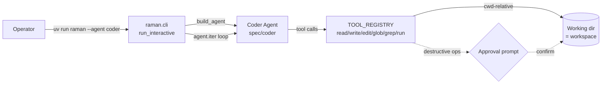

# Spec: Coding Agent for Raman

> Snapshot updated May 2026 — Phases 1-3 are implemented as of 2026-05-29.
> Re-verify `file:line` references when this file is more than a quarter old.
>
> Companion to the phased [coding-agent-roadmap.md](coding-agent-roadmap.md) and
> to Axis 1 (Multi-agent) of
> [../architecture_roadmap.md](../architecture_roadmap.md), which already frames
> Raman growing cooperating specialists. The coding agent is one such
> specialist.

## Problem & goal

Raman should be able to act as a **coding agent**: read and edit files in a
repository, run commands (tests, formatters, git), and iterate toward a change
the way an interactive coding assistant does.

Before the coder agent, every Raman agent was a thin spec — a
`spec/<name>/agent.toml` + system prompt + a flat list of mostly
string-returning async tools resolved from `TOOL_REGISTRY`. The original shipped
tools were only `web_search` and `grocery_list`; nothing read the filesystem or
ran a command, and no agent had a notion of a working directory.

Scope is **single-user, personal** throughout — one operator, no concurrency,
no multi-tenant isolation concerns. Enterprise patterns are out of scope.

## Surface decision: the CLI

The coding agent's home is **`raman/cli.py`**, not Telegram or HTTP.

The CLI already provides, for free, the hard parts of a coding-agent UX:

- **A real agentic loop.** `run_interactive` (`raman/cli.py:149`) drives
  `agent.iter()` and streams every node via `_render_turn`
  (`raman/cli.py:193`) — model requests, thinking, and tool calls.
- **Tool-call tracing.** `_render_call_tools` (`raman/cli.py:310`) prints
  `→ tool(args)` then `✓ tool 1.2s` with the result body — exactly the
  "show me what it's doing" view a coding agent needs.
- **Stateful sessions.** `messages` is threaded across turns via
  `message_history`, so a coding session accumulates context naturally.
- **Runs locally, as the user, in the current working directory.** This is the
  decisive property: the CLI executes on the dev machine, so **cwd is the
  workspace** and the shared production droplet is never exposed to
  LLM-driven shell.

Telegram and HTTP are **out of scope** for coding: no diff rendering, 4096-char
message caps, autonomous execution with no human in the loop, and — most
importantly — running shell there would mean running it on the shared prod host
alongside Caddy, Postgres, and secrets. Keeping the coding agent CLI-only
sidesteps the entire sandboxing problem.

## Architecture

Reuse the existing factory and spec pattern — no new runtime shape:

- **New agent spec** `spec/coder/agent.toml` + `system_prompt.md`, built by the
  existing `build_agent()` (`raman/agent.py:11`). **Crucially**, `raman/api.py` must
  be updated with an explicit allowlist/denylist to prevent loading the `coder`
  spec over HTTP, enforcing the CLI-only safety boundary.
- **Workspace** is the process cwd. No separate workspace lifecycle — the CLI's
  existing `message_history` threading is the session state.
- Selectable with `uv run raman --agent coder` (the CLI already supports
  `--agent`, `raman/cli.py:130`).
- **MCP toolsets** are mounted via the same spec as an additive capability — see
  [Tools](#tools). This is a shared `build_agent` / `AgentSpec` change, not
  coder-specific.

## Tools

The basic file/edit/search/exec tools are **own tools** — hand-rolled entries in
`TOOL_REGISTRY` (`raman/tools.py:126`), each an async callable returning a
string, all **cwd-relative**, grouped into tiers that map to the roadmap
phases. Owning them keeps the core loop dependency-free and lets us drive the
approval gate (below) precisely:

| Tier      | Tools                                      | Risk                       |
| --------- | ------------------------------------------ | -------------------------- |
| Read-only | `read_file`, `glob`, `grep`                | safe                       |
| Write     | `write_file`, `edit_file` (string-replace) | needs approval             |
| Exec      | `run_command`                              | needs approval + allowlist |

### MCP compatibility (platform-wide)

Separately, agents should be able to mount **MCP servers** as additional
toolsets (e.g. a git server, or domain MCPs). This is **additive** — it does not
replace the own tools above. Pydantic AI accepts MCP servers as `toolsets` on
the `Agent`, so the change is:

- Extend `AgentSpec` (`raman/spec.py:12`) with an opt-in field (e.g.
  `mcp_servers`).
- Extend `build_agent()` (`raman/agent.py:11`) to construct the configured MCP
  clients and pass them via `toolsets=` alongside the existing
  `tools=[TOOL_REGISTRY[...]]`.

This is a **shared change to `build_agent` / `AgentSpec`, so it lands across all
agents**, not just the coder. It is backward-compatible: the field defaults to
empty, so the existing agents (raman/leo/gobind) are unaffected until they opt
in. The coder is simply the first consumer. Tracked as its own roadmap phase.

## Model provider

**Decision (2026-05-28): reuse the existing `digitalocean` provider with
Gemma4, same as the other agents — no new model code for now.** Set
`RAMAN_MODEL_PROVIDER=digitalocean` and keep `RAMAN_DEV_MODEL` on Gemma4
(`gemma4:26b-mlx`, `raman/settings.py:55`); the `digitalocean` branch of
`build_model()` (`raman/settings.py:172`) already serves it via the DO
inference endpoint. No new `ModelProvider` value and no extra provider branch
are needed.

This keeps the coding agent consistent with the rest of the platform. The
trade-off, accepted for now: Gemma4 is **unproven at sustained agentic tool-use
coding**, so Phase 1 doubles as a feasibility check. If model quality turns out
to be the blocker, the documented fallback is a stronger hosted model — a
follow-up, not a prerequisite. Keep `parallel_tool_calls` off (flagged flaky
outside strong models; see the model-knob comments in `spec/raman/agent.toml`).

## Approval gate

Destructive tools — `write_file`, `edit_file`, `run_command` — must **confirm
before executing**. This is the main safety addition.

It is feasible precisely *because* the surface is the interactive, local CLI: a
prompt_toolkit confirmation (the same library already used in
`run_interactive`) before the tool runs, in the spirit of Claude Code's
permission prompts. Declining must leave the working tree untouched. This is
the one surface where human-in-the-loop is easy — it is infeasible over
Telegram/HTTP, which is another reason those surfaces are out of scope.

## Safety & scope boundaries

- **cwd-scoped.** Tools operate relative to the working directory; reject paths
  that escape it unless explicitly confirmed.
- **Never wired into Telegram/HTTP.** The `coder` spec is CLI-only; it is not
  added to any Telegram bot in `spec/telegram.toml`.
- **Secrets.** Honors the repo CLAUDE.md rules — never print or commit values
  from `.env.*`, Terraform state, or secrets.
- **`run_command` allowlist.** Start with a conservative allowlist (tests,
  formatters, git status/diff) plus the approval gate; widen deliberately.

## Caveats & risks

- **Private API coupling → own it.** The CLI currently imports a *private*
  Pydantic AI module: `from pydantic_ai._cli import CustomAutoSuggest,
  handle_slash_command` (`raman/cli.py:152`), which carries no stability
  contract and can break on any pydantic-ai bump. **Decision (2026-05-28):
  reimplement slash-command handling and autosuggest ourselves against public
  prompt_toolkit / Rich APIs and drop the `_cli` import** before extending the
  CLI further (Phase 5). This decouples the coding-agent surface from
  pydantic-ai internals; the rest of `cli.py` already uses public surfaces
  (`pydantic_ai.Agent`, `pydantic_ai.messages.*`).
- **Model capability.** Gemma4 on DO is unproven at agentic tool-use coding
  (see [Model provider](#model-provider)); Phase 1 is the feasibility gate,
  with a stronger model as the documented fallback.
- **Model reliability.** Agentic coding stresses tool-use correctness; expect
  iteration on the system prompt and tool descriptions.

## Out of scope

- Autonomous coding over Telegram or HTTP.
- Multi-session / multi-workspace orchestration.
- Sandboxed execution on the production droplet.

Revisit these only if a non-CLI surface is ever genuinely wanted; each
re-introduces the sandboxing problem the CLI-only decision avoids.
