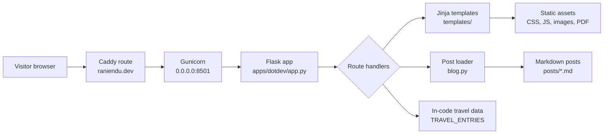
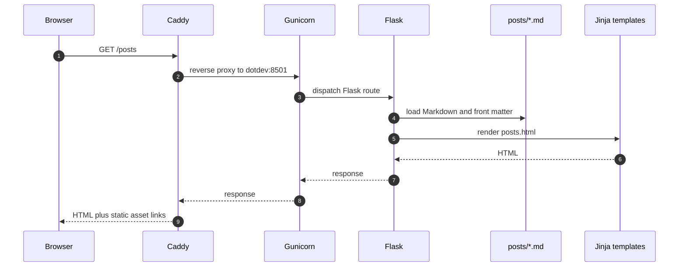

# DotDev Architecture

DotDev is the Flask personal site in `apps/dotdev/`. It serves server-rendered
pages, Markdown-backed posts, static assets, and a client-side travel map from a
single Gunicorn process listening on port `8501`.

## Runtime Topology



## Components

| Component | Path | Responsibility |
| --- | --- | --- |
| Flask application | `apps/dotdev/app.py` | Defines page routes, API routes, template context, and travel-page data. |
| Blog loader | `apps/dotdev/blog.py` | Parses Markdown front matter, renders Markdown to HTML, builds archive and word-cloud data. |
| Templates | `apps/dotdev/templates/` | Renders shared layout and route-specific pages. |
| Static assets | `apps/dotdev/static/` | Holds CSS, browser JavaScript, images, and downloadable resume assets. |
| Posts | `apps/dotdev/posts/` | File-backed content store for the posts timeline. |
| Image | `apps/dotdev/Dockerfile` | Builds a Python 3.13 uv environment and starts Gunicorn on `8501`. |

## Request Flow



## Data Model

DotDev has no database. The durable content model is file based:

- Markdown posts are source-controlled files with `title`, `date`, and `tags`
  front matter.
- Travel entries and map pins are Python data structures in `app.py`.
- Static images, JavaScript, CSS, and documents are source-controlled assets.

The `Post` dataclass in `blog.py` is the main in-process content shape:
`slug`, `title`, `date`, `tags`, `content_html`, `excerpt`, and `word_bank`.

## Deployment Boundary

Local Compose builds `apps/dotdev/Dockerfile` and exposes `localhost:8501` plus
`http://dotdev.localhost` through Caddy. Production uses a SHA-pinned GHCR image
behind `https://raniendu.dev`; `www.raniendu.dev` redirects to the apex domain.

## Validation

Use the targeted app test suite after route, template, post-rendering, or blog
loader changes:

```bash
uv run --project apps/dotdev pytest apps/dotdev/tests -q
```
