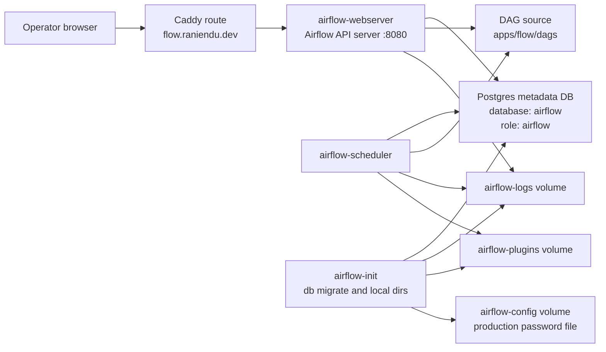
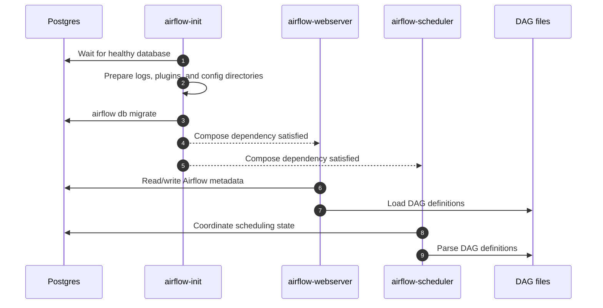

# Flow / Airflow Architecture

Flow is the Apache Airflow app in `apps/flow/`. It packages DAG source, a DAG
validation script, tests, and a custom Airflow image. The runtime is an Airflow
API server plus scheduler backed by Postgres metadata.

## Runtime Topology



## Components

| Component | Path | Responsibility |
| --- | --- | --- |
| DAGs | `apps/flow/dags/` | Airflow DAG definitions. Current example DAG runs a simple `start -> print_hello -> end` chain. |
| DAG validation | `apps/flow/scripts/validate-dags.py` | Imports and validates DAG files before reporting completion. |
| Tests | `apps/flow/tests/` | Exercises DAG import and behavior expectations. |
| Image | `apps/flow/Dockerfile` | Builds from `apache/airflow:3.1.7-python3.10`, copies DAGs, and exposes `8080`. |
| Compose services | `deploy/compose/docker-compose.*.yml` | Defines `airflow-init`, `airflow-webserver`, `airflow-scheduler`, Postgres wiring, volumes, and resource-conscious production settings. |

## Startup Flow



## Data Ownership

Airflow owns metadata in a Postgres database named `airflow`, using role
`airflow`. The schema is managed by Airflow migrations, not by migrations in
this repository.

- Local: dedicated `airflow-postgres` container and `airflow-postgres-data`
  Docker volume.
- Production: shared `platform-postgres` container, database `airflow`, role
  `airflow`, and the shared `postgres-data` volume.
- Connection variable: `AIRFLOW__DATABASE__SQL_ALCHEMY_CONN`.
- Additional durable volumes: `airflow-logs`, `airflow-plugins`, and, in
  production, `airflow-config`.

Logical datastore ownership is documented in
[`docs/database/platform-app-datastores.dbml`](../database/platform-app-datastores.dbml).

## Production Constraints

Production runs on the shared `s-1vcpu-2gb` Droplet, so Compose sets
conservative Airflow concurrency values:

- `AIRFLOW__CORE__PARALLELISM=2`
- `AIRFLOW__CORE__MAX_ACTIVE_TASKS_PER_DAG=2`
- `AIRFLOW__CORE__MAX_ACTIVE_RUNS_PER_DAG=1`
- `AIRFLOW__SCHEDULER__PARSING_PROCESSES=1`

Keep DAG imports lightweight and avoid designs that assume high scheduler or
worker concurrency.

## Deployment Boundary

Local Compose runs Airflow with a dedicated local Postgres container. Production
runs `airflow-init`, `airflow-webserver`, and `airflow-scheduler` only when
`DEPLOY_FLOW=true`. The current production app flags keep Flow disabled while
preserving the code, route, database, and volumes.

## Validation

Validate DAG imports first, then run the app tests:

```bash
uv run --project apps/flow python apps/flow/scripts/validate-dags.py
uv run --project apps/flow pytest apps/flow/tests/
```
