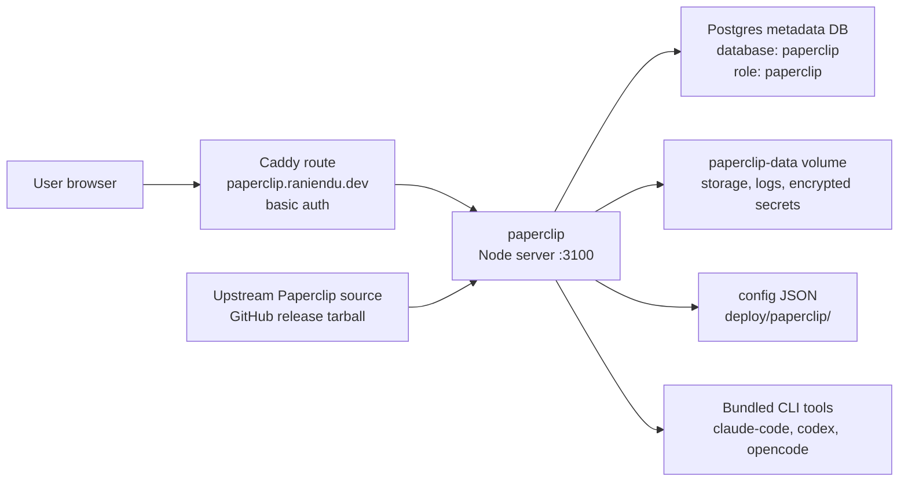
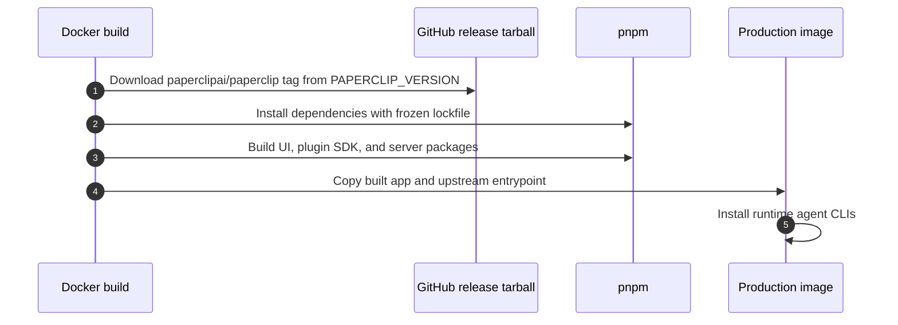

# Paperclip Architecture

Paperclip is an upstream Paperclip AI app wrapper in `apps/paperclip/`. The repo
does not own Paperclip application source code; it owns the Docker build,
runtime configuration, routing, Postgres wiring, local disk storage, and
operational bootstrap workflow.

## Runtime Topology



## Components

| Component | Path | Responsibility |
| --- | --- | --- |
| Wrapper image | `apps/paperclip/Dockerfile` | Downloads a pinned upstream release, builds Paperclip packages, installs runtime agent CLIs, and starts the Paperclip server. |
| Local config | `deploy/paperclip/config.local.json` | Sets local hostnames, private exposure, local disk storage, file logging, and telemetry disabled. |
| Production config | `deploy/paperclip/config.prod.json` | Sets production hostname, public exposure behind Caddy auth, local disk storage, file logging, and telemetry disabled. |
| Database init | `deploy/postgres/ensure-paperclip-db.sh` | Creates or updates the `paperclip` role and database in an existing shared Postgres volume. |
| Admin bootstrap | `.github/workflows/paperclip-bootstrap-admin.yml` | Runs the upstream admin bootstrap command through the production host and uploads the invite as a workflow artifact. |

## Build Flow



## Data Ownership

Paperclip owns two durable data surfaces:

- Postgres metadata in database `paperclip`, role `paperclip`. The schema is
  managed by upstream Paperclip migrations, not by this repository.
- Local disk data under `/paperclip`, persisted through the `paperclip-data`
  Docker volume. The config stores local disk uploads under
  `/paperclip/instances/default/data/storage`, file logs under
  `/paperclip/instances/default/logs`, and encrypted local secrets under
  `/paperclip/instances/default/secrets/master.key`.

Local development uses a dedicated `paperclip-postgres` container. Production
uses shared `platform-postgres` plus the idempotent `paperclip-db-init`
one-shot service because existing initialized Postgres volumes do not rerun
entrypoint init scripts.

Logical datastore ownership is documented in
[`docs/database/platform-app-datastores.dbml`](../database/platform-app-datastores.dbml).

## Deployment Boundary

Local Compose starts Paperclip and routes `http://paperclip.localhost` through
Caddy basic auth. Production builds and runs Paperclip only when
`DEPLOY_PAPERCLIP=true`; the current production app flags keep it disabled and
return `404` at the public route. Caddy basic auth remains the public edge when
enabled, in addition to Paperclip's own authenticated deployment mode.

## Validation

Paperclip has no local test suite in this repo. For configuration-only changes,
validate Compose rendering:

```bash
docker compose -f deploy/compose/docker-compose.local.yml --env-file .env.local config
COMPOSE_PROFILES=paperclip docker compose -f deploy/compose/docker-compose.prod.yml --env-file .env.production.generated config
```
