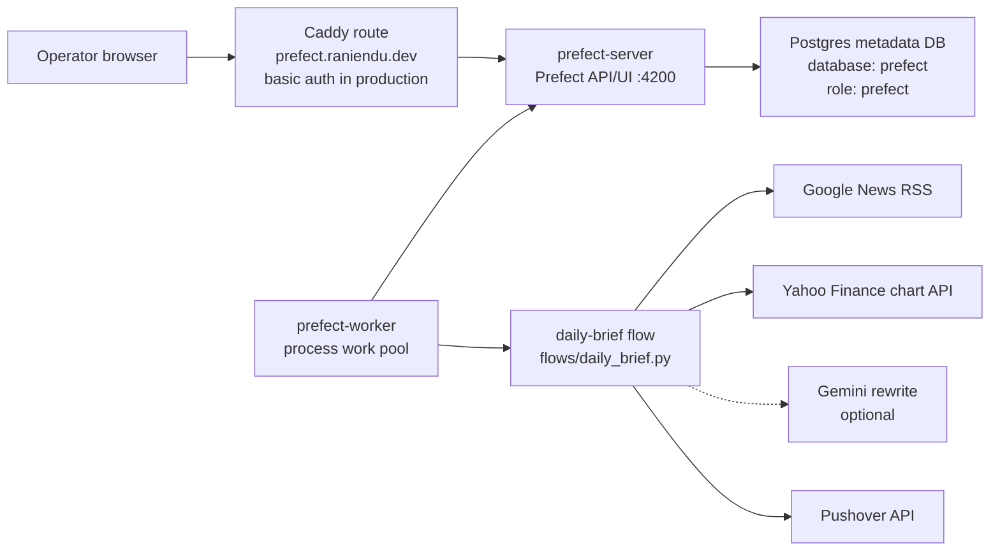
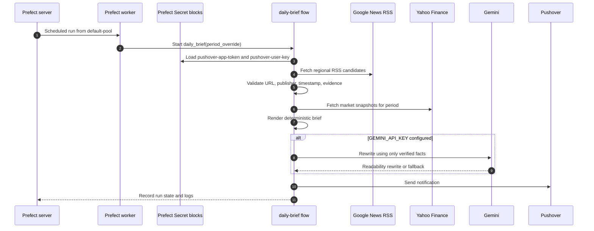

# Prefect Architecture

Prefect is the orchestration app in `apps/prefect/`. It packages the Prefect
server, a process worker, flow definitions, flow registration scripts, and a
daily brief flow that sends verified Pushover notifications.

## Runtime Topology



## Components

| Component | Path | Responsibility |
| --- | --- | --- |
| Flow definitions | `apps/prefect/flows/` | Holds Prefect `@flow` modules. The current primary flow is `daily-brief`. |
| Daily brief pipeline | `apps/prefect/flows/daily_brief.py` | Fetches candidate news, verifies required source metadata, fetches market data, renders a deterministic brief, optionally rewrites it, and sends Pushover. |
| Settings | `apps/prefect/config/settings.py` | Encapsulates environment-specific Prefect and database configuration. |
| Block setup | `apps/prefect/scripts/setup-blocks.py` | Validates Pushover credentials from deploy env and saves them as Prefect Secret blocks. |
| Deployment registration | `apps/prefect/scripts/deploy-flows.py` | Discovers flow objects and registers deployments against a Prefect API URL. |
| Worker startup | `apps/prefect/docker/prefect/start-worker.sh` | Waits for the server, creates the work pool if missing, and starts the process worker. |
| Image | `apps/prefect/Dockerfile` | Builds a Python 3.10 uv environment with flows, config, scripts, and worker entrypoint. |

## Flow Execution



## Data Ownership

Prefect owns metadata in a Postgres database named `prefect`, using role
`prefect`. The schema is managed by Prefect itself, not by migrations in this
repository.

- Local: dedicated `prefect-postgres` container and `prefect-postgres-data`
  Docker volume.
- Production: shared `platform-postgres` container, database `prefect`, role
  `prefect`, and the shared `postgres-data` volume.
- Connection variable: `PREFECT_API_DATABASE_CONNECTION_URL`.

Logical datastore ownership is documented in
[`docs/database/platform-app-datastores.dbml`](../database/platform-app-datastores.dbml).

## Scheduling

`deploy-flows.py` gives `daily-brief` two scheduled deployments:

| Deployment | Schedule | Timezone | Parameters |
| --- | --- | --- | --- |
| `morning-brief` | `0 7 * * *` | `America/Los_Angeles` | `period_override="Morning"` |
| `afternoon-brief` | `0 16 * * *` | `America/Los_Angeles` | `period_override="Afternoon"` |

## Deployment Boundary

Local Compose runs `prefect-server`, `prefect-worker`, and `prefect-postgres`.
Production runs `prefect-server` and `prefect-worker` only when
`DEPLOY_PREFECT=true`; metadata persists in shared Postgres. Production Caddy
protects the Prefect route with basic auth, so a public health check returning
`401` is expected.

## Validation

Use property tests for flow registration, deployment configuration, and daily
brief behavior:

```bash
uv run --project apps/prefect pytest apps/prefect/tests/property/
```
