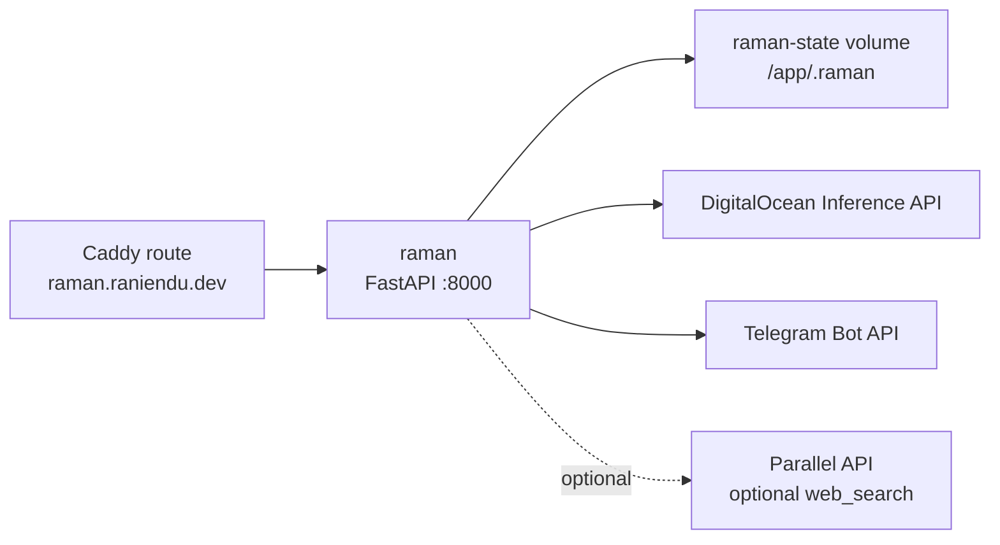

# Raman Architecture

Raman is the personal agent service under `apps/raman/`. The platform deploy
workflow builds the app image from that directory, provides runtime
environment, persists local state, and routes public traffic through Caddy.

## Runtime



The container listens on plain HTTP port `8000`. Production exposes only Caddy
on ports `80` and `443`; Caddy forwards `https://raman.raniendu.dev` to
`raman:8000`.

Raman supports multiple Telegram bots inside one process. Bot bindings live in
`apps/raman/spec/telegram.toml`; each bot names a default agent spec and env
vars for its BotFather token, webhook secret, and allowed chat IDs. The named
webhook path is `/telegram/{bot_name}/webhook`; `/telegram/webhook` remains a
default-bot alias.

## State

Raman stores SQLite thread history and DBOS workflow state under `/app/.raman`.
Both local and production Compose mount that path from the `raman-state` named
volume. Losing the volume loses conversation history and in-flight DBOS state,
but does not affect the built image.

Telegram thread rows are scoped by bot, so the same Telegram chat ID can talk to
two Raman bots without sharing history. The `/agent <name>` command can still
switch to any valid `spec/<name>/agent.toml` within that bot-scoped chat.
In group chats, Raman only responds when mentioned, replied to, or invoked by a
command. Group history is shared by Telegram chat ID, while sender display names
are added only as prompt context. Group `/reset` and `/agent` commands require
Telegram chat-admin status.

## Configuration

Production uses `RAMAN_MODEL_PROVIDER=digitalocean` and
`RAMAN_DEV_MODEL=gemma-4-31B-it`. `RAMAN_DEV_MODEL` is the upstream Raman
setting for the provider-specific model identifier, so in production it names a
DigitalOcean serverless inference model rather than a local development model.
The deploy workflow appends those production constants to the host env file and
validates the DigitalOcean inference key from the GitHub `production`
environment when `DEPLOY_RAMAN=true`. Raman Telegram secrets are supplied by
the env names referenced in `spec/telegram.toml`; production deploy writes those
values to `/opt/platform/.env.raman` so only Raman receives them.
`PARALLEL_API_KEY` is optional unless the active Raman agent spec enables
`web_search`.

Local Compose builds `apps/raman` and defaults to `RAMAN_MODEL_PROVIDER=ollama`
and `RAMAN_DEV_MODEL=gemma4:26b`, with
`OLLAMA_BASE_URL` pointing at `host.docker.internal:11434` so a host Ollama
daemon can serve the container.

## Validation

```bash
uv run --project apps/raman pytest apps/raman/tests -q
bash deploy/scripts/prod-app-flags.sh validate deploy/apps.prod.env
bash deploy/scripts/render-prod-caddy.sh deploy/apps.prod.env deploy/caddy/prod-sites
RAMAN_IMAGE=ghcr.io/raniendu/platform/raman:ci docker compose -f deploy/compose/docker-compose.prod.yml --env-file .env.ci config
docker compose -f deploy/compose/docker-compose.local.yml --env-file .env.local config
```
