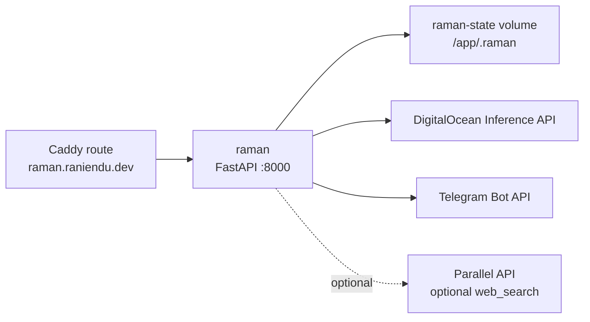

# Raman Architecture

Raman is an external agent service owned by the
[`raniendu/raman`](https://github.com/raniendu/raman) repository. This platform
repo does not build Raman; it pulls the published GHCR image, provides runtime
environment, persists local state, and routes public traffic through Caddy.

## Runtime



The container listens on plain HTTP port `8000`. Production exposes only Caddy
on ports `80` and `443`; Caddy forwards `https://raman.raniendu.dev` to
`raman:8000`.

## State

Raman stores SQLite thread history and DBOS workflow state under `/app/.raman`.
Both local and production Compose mount that path from the `raman-state` named
volume. Losing the volume loses conversation history and in-flight DBOS state,
but does not affect the external image.

## Configuration

Production uses `RAMAN_MODEL_PROVIDER=digitalocean` and
`RAMAN_DEV_MODEL=llama3.3-70b-instruct`. The deploy workflow validates the
DigitalOcean inference key and Telegram secrets when `DEPLOY_RAMAN=true`.
`PARALLEL_API_KEY` is optional unless the active Raman agent spec enables
`web_search`.

Local Compose pulls `ghcr.io/raniendu/raman:main` and defaults to
`RAMAN_MODEL_PROVIDER=ollama`, with `OLLAMA_BASE_URL` pointing at
`host.docker.internal:11434` so a host Ollama daemon can serve the container.

## Validation

```bash
bash deploy/scripts/prod-app-flags.sh validate deploy/apps.prod.env
bash deploy/scripts/render-prod-caddy.sh deploy/apps.prod.env deploy/caddy/prod-sites
RAMAN_IMAGE=ghcr.io/raniendu/raman:ci docker compose -f deploy/compose/docker-compose.prod.yml --env-file .env.ci config
docker compose -f deploy/compose/docker-compose.local.yml --env-file .env.local config
```
